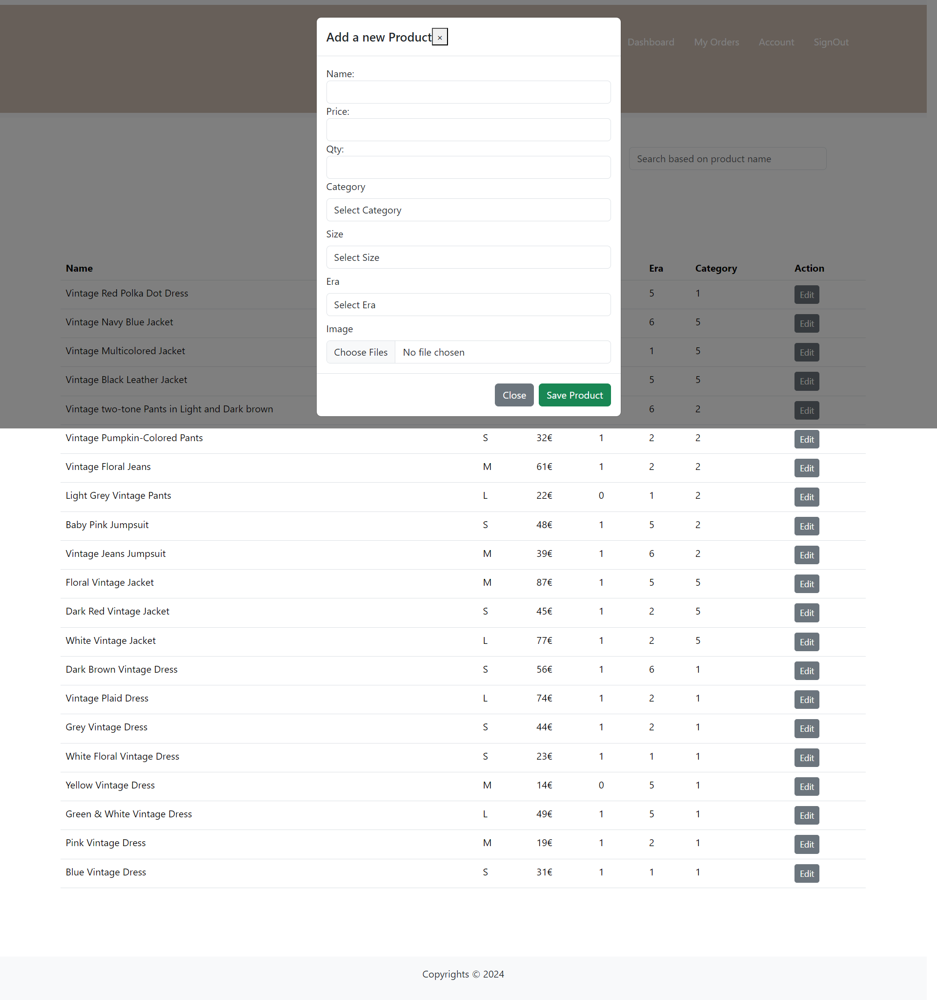
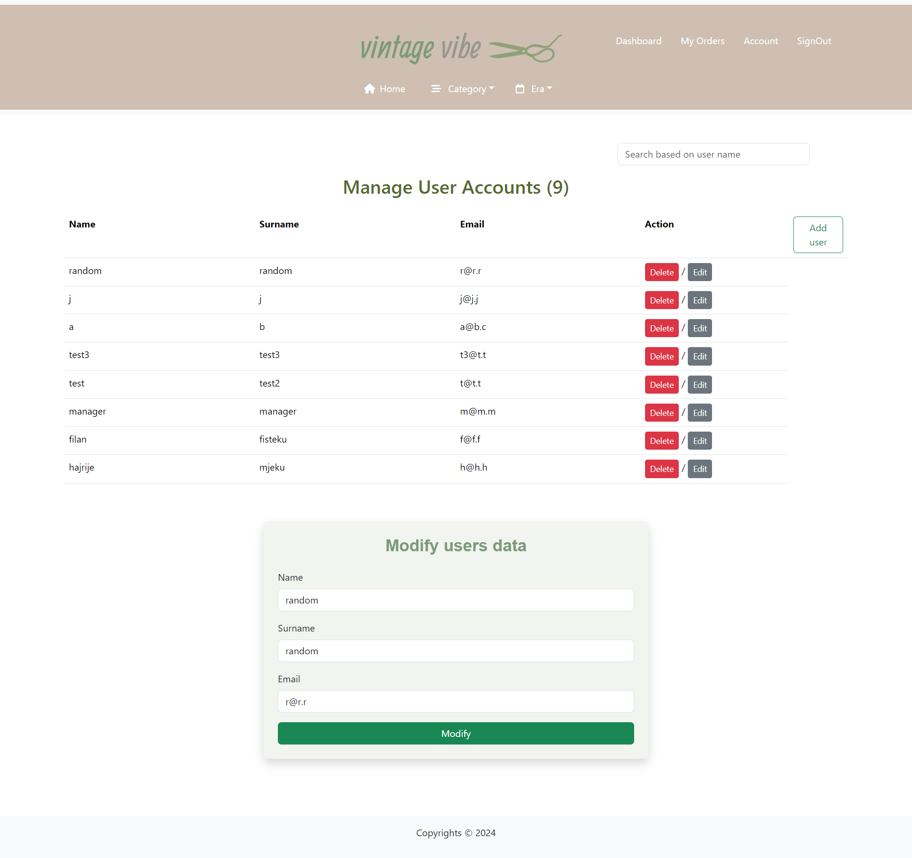

# VintageVibe

## Permbledhje
`VintageVibe` eshte nje e-commerce web aplikacion i dizajnuar per shit/blerje te veshjeve vintage. Zbuloni thesare te fshehur dhe krijoni stilin tuaj unik me veshje nga epokat e kaluara. Eshte i bazuar ne 3 role:Admin, Manager dhe User. Lejon perdoruesit te krijojne llogari, te kyçen, te modifikojne dhe te fshijne llogarine e tyre. Perdoruesit gjithashtu mund te shfletonin dhe te bejne porosi apo edhe te shtojne ne listen e tyre te deshirave produktet e pelqyera. Menaxhimi i porosive mund te behet nga Menaxheret, te cilet pervec qe pranojne dhe dergojne porosine, mund edhe te modifikojne produktet e te bejne porosi te tyre. Ndersa perdoruesi me rol Admini ka qasje ne nje panel kontrolli per te menaxhuar (CRUD) te dhenat e perdoruesve, produktet dhe porosite.

## Karakteristikat

- **Index Page**: Ne Index jane te shfaqura te gjitha produktet, te cilat edhe mund te filtrohen sipas deshires sone: Nga cmimi me i larte tek ai me i ulet dhe anasjelltas (mundesuar nga shigjetat) e deri tek filtrimi produkteve ne baze te kategorise,madhesise apo edhe eres se ciles i takojne. 

- **Wishlist Page**: Produktet ne Index mund te klikohen per te pare detajet, si dhe mund te shtohen/fshihet ne/nga Wishlist edhe nese nuk jemi te kycur ne ndonje llogari. Mirepo shtimi ne Cart nuk eshte e mundur nese nuk jemi te kycur ne llogari.

- **Category Page**: Me ndihmen e dropdown, mund t'i filtrojme te dhenat sipas kategorise(tabele kjo ne baze te te dhenave) dhe varesisht nga zgjedhja shfaqen produktet. Po ashtu, me ndihmen e input=range, mund te filtrohen produktet per cdo kategory ne baze te cmimit ku si vlere max e kemi marr cmimin me te larte te asaj kategorie nga baza e te dhenave (Me poshte kemi nje shembull ku te dhenat e paraqitura jane filtruar ne baze te cmimit(85€)).

- **Era Page**: Ngjashem me category, produktet mund t'i filtrojme me ndihmen e dropdown edhe sipas eres (tabele kjo ne baze te te dhenave).Po ashtu, me ndihmen e input=range, mund te filtrohen produktet per cdo ere ne baze te cmimit ku si vlere max e kemi marr cmimin me te larte te asaj ere nga baza e te dhenave (Me poshte kemi nje shembull ku te dhenat e paraqitura jane filtruar ne baze te cmimit(46€)). Po ashtu, nese me cmimin e kerkuar nuk kemi ndonje produkt, shfaqet mesazhi qe tregon dicka te tille.

- **Autentikimi i Perdoruesit**: Regjistrimi i sigurt dhe funksionaliteti i kyçjes per perdoruesit.

- **Funksionalitet e Perdoruesit me Rol te Userit**:
  - Modifikoni informacionin e profilit te perdoruesit.
    
  - Fshini llogarine e perdoruesit. (Fshirja e llogarise mund te behet vetem me konfirmim te fjalekalimit si dhe eshte e mundur vetem per perdoruesit me rol te userit)
    
  - Perdoruesi mund t'i shoh porosite e tij. Ne rast se nuk ka te tilla, shfaqet nje mesazh. Porosite e perdoruesit mund te pranohen apo refuzohen nga admini apo menaxheri.
    
  - Perdoruesi mund t'i shoh detajet e produktit, dhe mund ti shtoj ne wishlist apo edhe ne cart me ndihmen e buttonit, per te vazhduar tutje me checkout. Per perdoruesin shfaqet edhe seksioni qe shfaq produkte te ngjashme me ato qe ka kerkuar apo klikuar ne baze te emrit te produktit.
    
  - Perdoruesi ka mundesi te fshij produktet nga cart-a apo edhe te vazhdoj tutje me checkout.
    
  - Me krijimin e porosise, produkti eshte out-of-stock (pasi qe qty e cdo produkti eshte 1) dhe nuk eshte i qasshem per tjeret.
    
  - Me ndryshimin e statusit te porosise nga pending ne sent apo cancelled, perdoruesi njoftohet tek lista e porosive te tij.
    

- **Paneli i Menaxherit**:
  - Paneli i Menaxherit perfshin menaxhimin e produkteve dhe menaxhimin e Porosive.
    
  - Menaxheri ka mundesi pervec te lexoj porosite, te bej kerkim, po ashtu edhe te ndryshoj statusin e porosise se perdoruesit nga pending ne sent, me c'rast edhe perdoruesi informohet per statusin e porosise se tij.
    
  - Menaxheri mund te modifikoj produkte
    
  - Menaxheri mund te shtoj produkte te reja
    
  - Menaxheri mund vetem te modifikoj te dhenat e llogarise se tij por jo edhe ta fshij ate.
    

- **Paneli i Adminit**:
  - Paneli i Adminit perfshin menaxhimin e produkteve, perdoruesve dhe menaxhimin e porosive.
    
  - Admini ka mundesi pervec te lexoj porosite, te bej kerkim, po ashtu edhe te ndryshoj statusin e porosise se perdoruesit nga pending ne sent, te anuloj porosine apo edhe ta fshij ate me c'rast edhe perdoruesi informohet per statusin e porosise se tij.
  PS. Me anulimin e porosise, produkti kthehet ne stock perseri.
    
  - Admini mund te modifikoj produkte, te kerkoj produkte, te shtoj produkte te reja apo edhe ti fshij ato.
    
  - Admini mund te shtoj perdorues te ri dhe te caktoj rolin e tyre:manager,admin apo user.
    
  - Admini mund te modifikoj te dhenat e perdoruesit apo edhe te fshij llogarine e perdoruesit
    
  - Admini mund vetem te modifikoj te dhenat e llogarise se tij por jo edhe ta fshij ate.
    

## Teknologjite e Perdorura
- **Frontend**: HTML, CSS, Bootstrap per dizajnin e pershtatshem.
- **Backend**: PHP per pjesen e serverit.
- **Baza e te Dhenave**: MySQL.

## Instalimi
Per te ekzekutuar `vintagevibe` lokal, ndiqni keto hapa:
1. Klononi repositorin: `git clone https://github.com/hajrijemjeku/vintagevibe`
2. Shkoni ne drejtorine e projektit: `cd vintagevibe`
3. Importoni skemen e bazes se te dhenave dhe te dhenat fillestare nga `sql/vintagevibe.sql` ne bazen tuaj MySQL.
4. Konfiguroni lidhjen me bazen e te dhenave ne `includes/db.php`.
5. Startoni serverin tuaj PHP per zhvillim ose konfiguroni me Apache/Nginx sipas nevojes.

## Perdorimi
1. Startoni serverin PHP.
2. Vizitoni `http://localhost/vintagevibe` ne shfletuesin tuaj web.
3. Regjistrohuni per nje llogari te re ose kyçuni me kredencialet ekzistuese.
4. Eksploroni dhe perdorni karakteristikat bazuar ne rol te perdoruesit tuaj (perdorues, menaxher apo admin).

